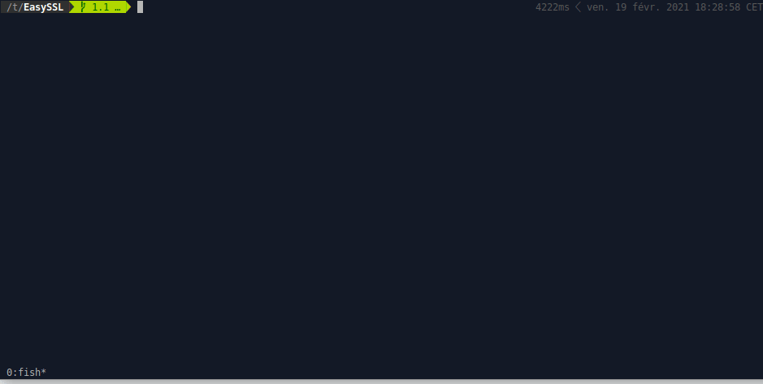

# EASYSSL

All the certificates you want in one short command !

* `platform` : make all the certificates, private keys, keystores and truststores for an entire platform
* `chain` : make a complete chain of trust from a CA root to a signed certificate 
* `store` : make keystores and truststores



## Requirements

According to `easyssl [feature]` : 

| Feature  | Requirements                                          |
|----------|-------------------------------------------------------|
| chain    | openssl 1.1.1                                         |
| store    | openssl 1.1.1<br>java >= 1.8<br>keytool               |
| platform | openssl 1.1.1<br>java >= 1.8<br>keytool<br>python 3.8 |
| util     | openssl 1.1.1                                         |

## Install

```sh
./install.sh
# main features
easyssl -h
```

## Get started

```sh
easyssl platform -h
easyssl chain -h
easyssl store -h
easyssl util -h
```

Try basic commands :

```sh
# All the TLS material for 3 connected hosts with various users
easyssl platform --conf conf_example.yml

# A chain of certificates for a host named 'node01'
easyssl chain --server
easyssl chain --extract /tmp

# A keystore and the related trustsore from existing keys and certs
easyssl store --create --key mykey.p8 --cert mycert.crt --cacert myca_file.crt --pass secret
```

## Platform configuration

```sh
easyssl platform -c conf.yaml
```

The configuration is platform-based :

| Configuration  | Mandatory | Default | Description |
| --- | --- | --- | --- |
| platform.password | Yes | None | The password given to all keystores and truststore of the platform. |
| platform.hosts | Yes | None | The list of hosts of the platform. |

The TLS material is generated per host in `platform.hosts` and optionally per user :

| Configuration  | Mandatory | Default | Description |
| --- | --- | --- | --- |
| [host].hostname | Yes | None | The hostname is used for the key and keystore file names and for the CN and the SAN of each certificate for this host. |
| [host].ip | No | None | IPv4. The IP is used for the SAN of each certificate for this host. |
| [host].users | No | None | List of names. For each name, additional keys and keystores are generated for this host. Each name is used for the file names=`hostname-user.extension`, and the CN=`hostname-user`. |
| [host].cn | No | None | Overrides the CN of each generated certificate for this host |

